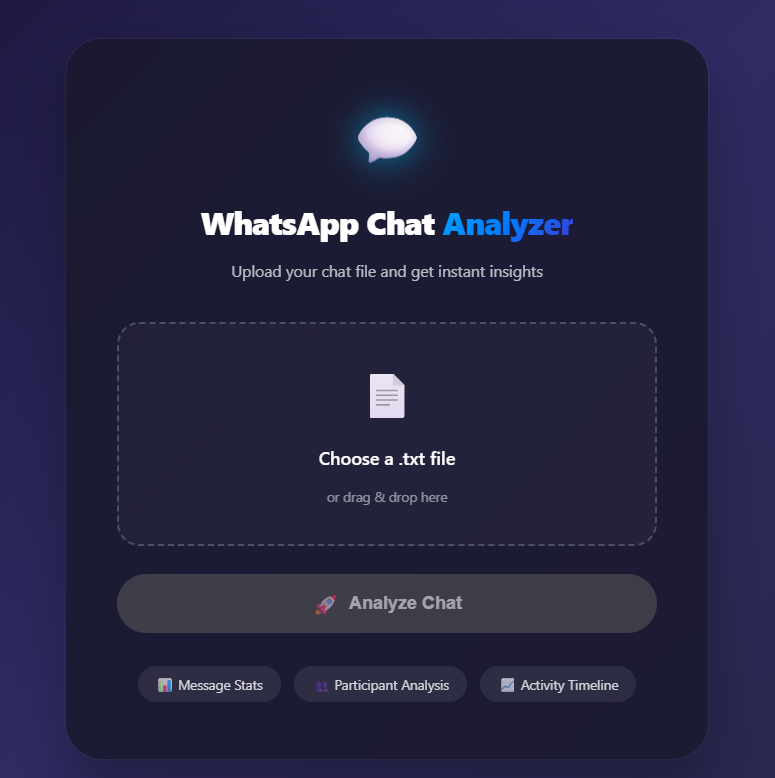
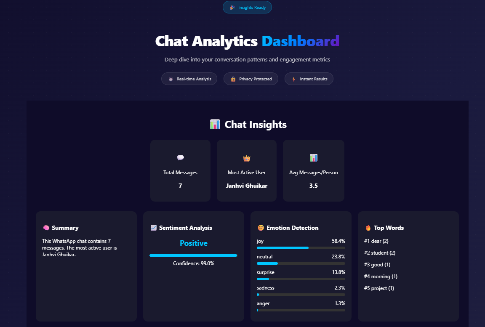
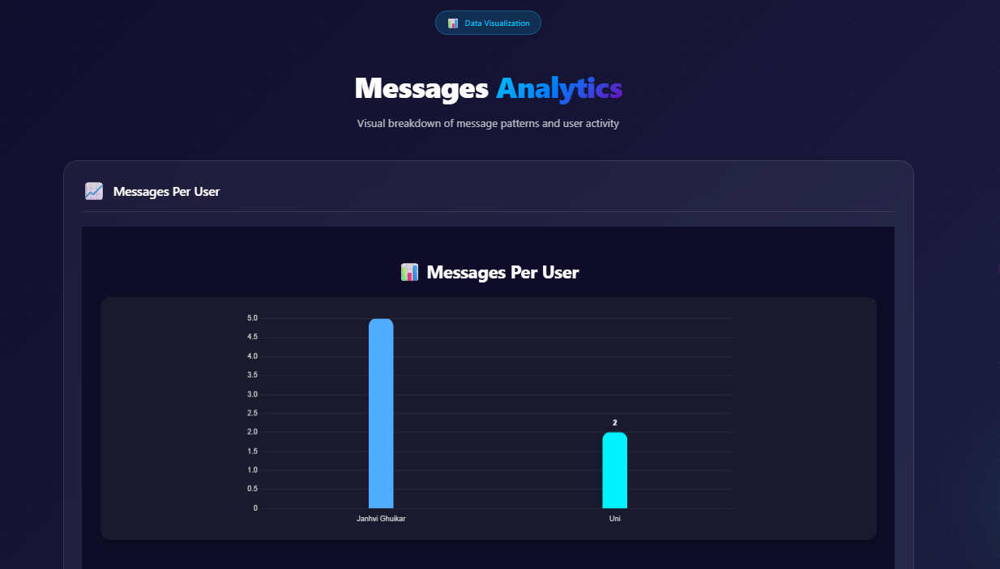
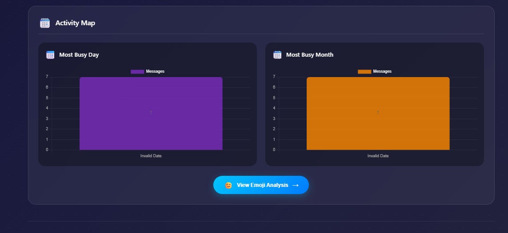
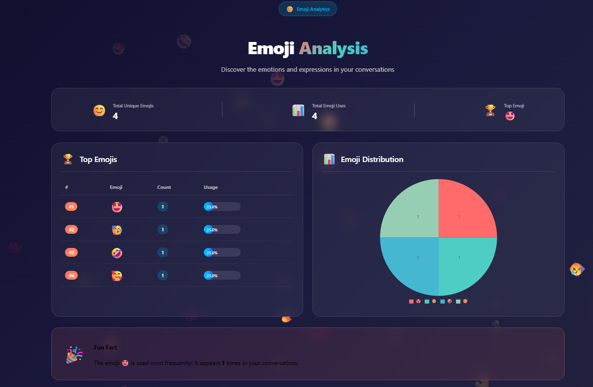

# 💬 WhatsApp Chat Analyzer with AI Insights

Analyze exported WhatsApp chats using **Artificial Intelligence**, **Natural Language Processing**, and **interactive data visualizations**.

A full-stack **MERN Stack** application that transforms raw WhatsApp chat exports into meaningful insights such as message statistics, sentiment analysis, emotion detection, emoji trends, participant activity, and interactive dashboards.

---

## 🚀 Live Demo

**🌐 Live Application**

https://whatsapp-analyzer-ten-pink.vercel.app

**💻 GitHub Repository**

https://github.com/Janhvi7105/whatsapp-analyzer

---

# 📖 Project Overview

WhatsApp Chat Analyzer is an AI-powered web application that analyzes exported WhatsApp chat files (`.txt`) and generates visual insights about conversations.

Instead of manually reading thousands of messages, users simply upload a chat export and instantly receive:

- 📊 Chat Statistics
- 📈 Activity Timeline
- 😊 Emoji Analysis
- 🔤 Word Frequency
- 🤖 Sentiment Analysis
- 🧠 Emotion Detection
- 👥 Participant Insights
- 📉 Interactive Charts

The project demonstrates full-stack development using the **MERN Stack**, combined with **Hugging Face AI** for Natural Language Processing.

---

# ✨ Features

### 📂 Chat Upload

- Upload exported WhatsApp `.txt` files
- Automatic chat parsing
- Supports multiple WhatsApp export formats
- Secure file processing

---

### 📊 Chat Statistics

- Total Messages
- Most Active Participant
- Average Messages per Person
- Conversation Summary
- User-wise Message Distribution

---

### 📈 Activity Analysis

Visualize conversation activity through:

- Daily Activity
- Monthly Activity
- Timeline Analysis
- Participant Activity

---

### 🔤 Word Analysis

- Most Frequently Used Words
- Stop-word Filtering
- Keyword Extraction
- Top Words Ranking

---

### 😊 Emoji Analysis

- Emoji Frequency
- Emoji Distribution
- Total Emoji Usage
- Most Used Emoji
- Emoji Statistics

---

### 🤖 AI-Powered Insights

Powered by **Hugging Face Inference API**

Features include:

- Positive / Neutral / Negative Sentiment
- Emotion Detection
- Confidence Score
- AI Generated Summary

Supported emotions:

- 😊 Joy
- 😐 Neutral
- 😢 Sadness
- 😠 Anger
- 😨 Fear
- 😲 Surprise

---

### 📊 Interactive Dashboard

Built using **Chart.js** and **Recharts**

Includes:

- Message Statistics
- Bar Charts
- Timeline Charts
- Emoji Charts
- Activity Graphs
- AI Insights Dashboard

---

# 🛠 Tech Stack

## Frontend

- React.js
- React Router
- Axios
- Chart.js
- Recharts

## Backend

- Node.js
- Express.js
- MongoDB Atlas
- Mongoose

## AI / NLP

- Hugging Face Inference API

## Other Tools

- Multer
- dotenv
- CORS
- Git
- GitHub
- Vercel
- Render

---

# 🏗️ Project Architecture

```
whatsapp-analyzer
│
├── backend
│   ├── config
│   ├── controllers
│   ├── models
│   ├── routes
│   ├── services
│   ├── uploads
│   ├── utils
│   └── server.js
│
├── frontend
│   ├── public
│   ├── src
│   │   ├── components
│   │   ├── pages
│   │   ├── services
│   │   └── App.js
│
├── screenshots
│
├── README.md
└── package.json
```

---

# ⚙️ Installation

## Clone the Repository

```bash
git clone https://github.com/Janhvi7105/whatsapp-analyzer.git

cd whatsapp-analyzer
```

---

## Backend Setup

```bash
cd backend

npm install
```

Create a `.env` file:

```env
PORT=5001
MONGO_URI=YOUR_MONGODB_URI
HUGGINGFACE_API_KEY=YOUR_API_KEY
```

Run backend

```bash
npm run dev
```

---

## Frontend Setup

```bash
cd frontend

npm install

npm start
```

---

# 🌐 Deployment

| Service | Platform |
|----------|----------|
| Frontend | Vercel |
| Backend | Render |
| Database | MongoDB Atlas |
| AI Model | Hugging Face |

---

# 📸 Application Screenshots

## 🏠 Home Page



---

## 📊 Chat Analytics Dashboard



---

## 📈 Messages Analytics



---

## 📅 Activity Analysis



---

## 😊 Emoji Analysis



---

# 📖 How to Use

1. Export a WhatsApp chat **without media**.
2. Save the chat as a `.txt` file.
3. Open the application.
4. Upload the chat file.
5. Click **Analyze Chat**.
6. Explore:
   - Message Statistics
   - AI Insights
   - Emoji Analysis
   - Charts
   - Activity Timeline

---

# 📌 Learning Outcomes

This project demonstrates practical experience with:

- MERN Stack Development
- REST API Design
- MongoDB Integration
- AI API Integration
- Natural Language Processing
- File Upload Handling
- Data Visualization
- Responsive UI Design
- Full-Stack Deployment
- Environment Variable Management

---

# 🚀 Future Enhancements

- User Authentication
- Chat History
- Multi-Chat Comparison
- PDF Report Generation
- Cloud Storage
- Topic Modeling
- Real-Time Analysis
- Advanced NLP Models
- Dark Mode
- Export Analytics

---

# 👩‍💻 Author

**Janhvi**

GitHub: https://github.com/Janhvi7105

